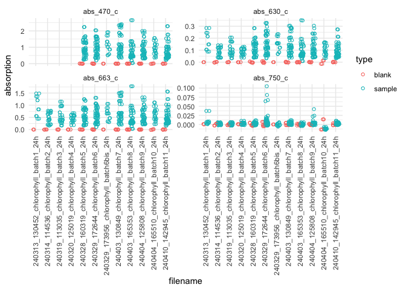

# `coralchlo`


## Coral Chlorophyll and Symbiodiniaceae Counts

This package helps during the analysis of chlorophyll a data and
Symbiodiniaceae counts. The data has to be prepared following these
[protocols](https://andieich.github.io/coral_chlorophyll_symcounts/).

The package can be installed with the `devtools` package:

``` r
devtools::install_github("andieich/coralchlo")
```

The current version is 0.0.0.2.

After installation, you can load the package and download the metadata
sheet. During this the import of the sheet, some basic test are done to
ensure it was filled out correctly and that the values make sense.

``` r
library(coralchlo)

link_metadatasheet <- "example_link"

dat_overview <- read_metadata(link_metadatasheet)
```

Then, the chlorophyll a concentration is calculated based on the
absorption measured with the photometer.

The photometer files (`.csv`) can be store in Google Drive or locally.
If they are stored locally, `path_to_biotekfolder`, is the path to the
folder containing these files. If they are stored in Google Drive,
`path_to_biotekfolder` is the path within the Google Drive to the folder
containing the photometer files. If you use Google Drive, set
`is_googledrive = TRUE`. The files are downloaded to a temporary folder
or to a folder specified in `download_directory`. All files in
`download_directory` will be replaced.

The values are blank-corrected. To ensure that the blank values make
sense, they are plotted for all wavelengths and photometer files. This
can be skipped by setting `plot = FALSE` in the
`normalise_chla_per_area()` function. The area data is used to normalize
the chlorophyll a concentration for the surface area of the coral
fragment. For each sample, two measurements were taken, therefore two
chlorophyll a concentrations will be exported.

``` r
dat_chla <- normalise_chla_per_area(dat_overview,
                                    path_to_biotekfolder = "example_path")
```



``` r
head(dat_chla, n = 10)
```

       sample_id measurement_replicate chl_a_per_cm2 chl_c2_per_cm2 chl_tot_per_cm2
    1   2TSML27P                    m1      3.416571      0.4155315        3.832102
    2   2TSML27P                    m2      3.416571      0.4155315        3.832102
    3   2TSPL07P                    m1      2.741200      0.3220933        3.063293
    4   2TSPL07P                    m2      2.747538      0.3200805        3.067618
    5   2TSAL09P                    m1      5.251357      0.5499048        5.801261
    6   2TSAL09P                    m2      5.251357      0.5499048        5.801261
    7   2TSML26P                    m1      6.467369      0.5805320        7.047901
    8   2TSML26P                    m2      6.467369      0.5805320        7.047901
    9   2TSAL07P                    m1      6.488811      0.6076038        7.096414
    10  2TSAL07P                    m2      6.488367      0.6264047        7.114771

Similarly, the Symbiodiniaceae counts are normalized for the surface
area of the coral fragment. Since six measurements are taken per sample,
six values are exported

``` r
dat_counts <- normalise_counts_per_area(dat_overview)
head(dat_counts, n = 10)
```

       sample_id count_replicate count_per_cm2
    1   2TSML27P              c1       4924526
    2   2TSML27P              c2       4559746
    3   2TSML27P              c3       5471696
    4   2TSML27P              c4       4377357
    5   2TSML27P              c5       5654086
    6   2TSML27P              c6       4742136
    7   2TSPL07P              c1       5267582
    8   2TSPL07P              c2       6099306
    9   2TSPL07P              c3       5128962
    10  2TSPL07P              c4       4297238
