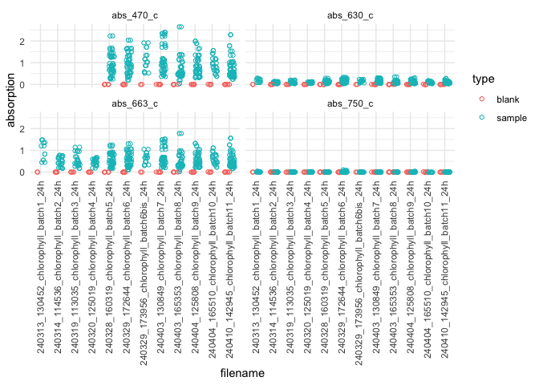

# coralchlo - Coral Chlorophyll and Symbiodiniaceae Counts


``` r
library(coralchlo)

link_metadatasheet <- "https://docs.google.com/spreadsheets/d/1KP-_yEQoHC9zHPlVpf3ob9BRJ60qNiGJsdZsO-l3ljw/edit?gid=0#gid=0"

dat_overview <- read_metadata(link_metadatasheet)
```

    ! Using an auto-discovered, cached token.

      To suppress this message, modify your code or options to clearly consent to
      the use of a cached token.

      See gargle's "Non-interactive auth" vignette for more details:

      <https://gargle.r-lib.org/articles/non-interactive-auth.html>

    ℹ The googlesheets4 package is using a cached token for
      'eich.andreas@gmail.com'.

    ✔ Reading from "test_meta".

    ✔ Range ''1. Overview&Chl''.

    ✔ Reading from "test_meta".

    ✔ Range ''2. Counts''.

    New names:
    ✔ Reading from "test_meta".
    ✔ Range ''3. Area''.
    New names:
    • `` -> `...4`

    # A tibble: 240 × 15
       sample_id type   w_slurry1 w_slurry2 m1    m2    filename  v_zoox  v_sw    c1
       <chr>     <chr>      <dbl>     <dbl> <chr> <chr> <chr>      <dbl> <dbl> <dbl>
     1 <NA>      blank       NA        NA   A1    A2    240313_1…     NA    NA    NA
     2 2TSML27P  sample      58        40.1 A3    A4    240313_1…    300   700    27
     3 2TSPL07P  sample      49.6      40.2 A5    A6    240313_1…    400   600    38
     4 2TSAL09P  sample      57.7      40.2 A7    A8    240313_1…    200   800    52
     5 2TSML26P  sample      46.9      40.1 A9    A10   240313_1…    200   800    38
     6 2TSAL07P  sample      49.7      40.1 A11   A12   240313_1…    400   600    69
     7 2TSAL06P  sample      49.8      40.2 B1    B2    240313_1…    200   800    46
     8 <NA>      blank       NA        NA   A1    A2    240314_1…     NA    NA    NA
     9 2ESPL20P  sample      48.2      40.1 A3    A4    240314_1…    500   500    83
    10 2ESPL10P  sample      48.2      40   A5    A6    240314_1…    300   700    53
    # ℹ 230 more rows
    # ℹ 5 more variables: c2 <dbl>, c3 <dbl>, c4 <dbl>, c5 <dbl>, c6 <dbl>
    # A tibble: 240 × 20
       sample_id type   w_slurry1 w_slurry2 m1    m2    filename  v_zoox  v_sw    c1
       <chr>     <chr>      <dbl>     <dbl> <chr> <chr> <chr>      <dbl> <dbl> <dbl>
     1 <NA>      blank       NA        NA   A1    A2    240313_1…     NA    NA    NA
     2 2TSML27P  sample      58        40.1 A3    A4    240313_1…    300   700    27
     3 2TSPL07P  sample      49.6      40.2 A5    A6    240313_1…    400   600    38
     4 2TSAL09P  sample      57.7      40.2 A7    A8    240313_1…    200   800    52
     5 2TSML26P  sample      46.9      40.1 A9    A10   240313_1…    200   800    38
     6 2TSAL07P  sample      49.7      40.1 A11   A12   240313_1…    400   600    69
     7 2TSAL06P  sample      49.8      40.2 B1    B2    240313_1…    200   800    46
     8 <NA>      blank       NA        NA   A1    A2    240314_1…     NA    NA    NA
     9 2ESPL20P  sample      48.2      40.1 A3    A4    240314_1…    500   500    83
    10 2ESPL10P  sample      48.2      40   A5    A6    240314_1…    300   700    53
    # ℹ 230 more rows
    # ℹ 10 more variables: c2 <dbl>, c3 <dbl>, c4 <dbl>, c5 <dbl>, c6 <dbl>,
    #   w_initial <dbl>, w1 <dbl>, w1_scratched <dbl>, w2 <dbl>, w2_scratched <dbl>

    Warning in get_area(dat_combined): 
    For the following samples, `w1_scratched` is higher than `w1`:
    2ESPL20P

    Warning in get_area(dat_combined): 
    For the following samples, `w2_scratched` is higher than `w2`:
    TSAS75
    2ESAL33P

``` r
dat_counts <- normalise_counts_per_area(dat_overview)

dat_chla <- normalise_chla_per_area(dat_overview,
                                    path_to_biotekfolder = "/Users/andi/Desktop/test_files")
```

    Warning: Removed 98 rows containing missing values or values outside the scale range
    (`geom_point()`).


